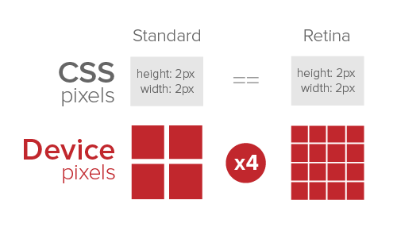
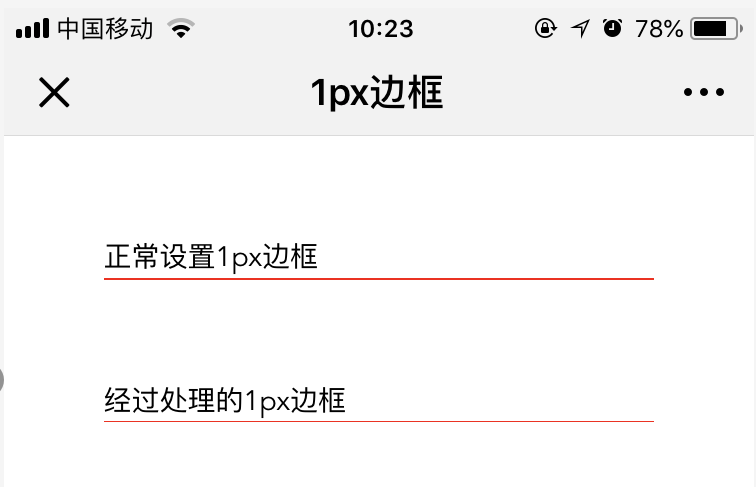
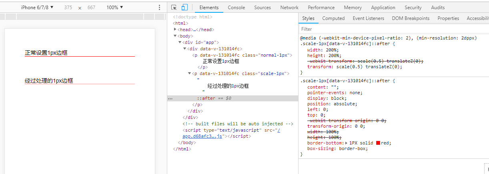
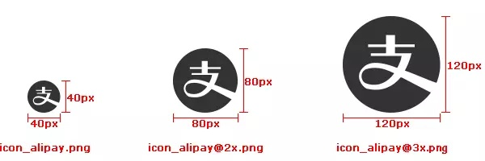

# 移动端适配——1px边框和多倍图
**作者：盛闯**
  
> 前一阵子有位同事问我为什么一个icon在不同手机上清晰度不一致，今天我们就来分享下这方面的知识点，顺便聊一下上次提到的1px边框。Retina屏是什么？如何在Retina屏上实现1px边框？为什么UI会给3种尺寸切图，也就是俗称的1x、2x、3x图？在面试的时候都会问这三个问题，但很少有人都答得上来，今天就简单地聊聊在不同屏幕下面的1px边框和图片的表现。  

## 概念
- ### 什么是Retina屏？  
  > 所谓“Retina”是一种显示标准，是把更多的像素点压缩至一块屏幕里，从而达到更高的分辨率并提高屏幕显示的细腻程度。---来自百度百科  
  >其实就是用更高的设备像素去渲染CSS像素。

- ### 设备独立像素(DIP、DP) 
  > 设备独立像素（又称设备无关像素 Device Independent Pixels 、密度独立性 Density Independent或设备独立像素，简称DIP或DP）是一种物理测量单位，基于计算机控制的坐标系统和抽象像素（虚拟像素），由底层系统的程序使用，转换为物理像素的应用。

- ### CSS像素(css pixel)
  > 属于设备独立像素。适用于web编程，指的是我们在样式代码中使用到的逻辑像素，是一个抽象概念，实际并不存在。css中的1px并不是总代表设备像素上的1px

- ### 设备像素(Device Pixel)
  > 也就是物理像素。设备分辨率的单位。在同一个设备上，它的物理像素个数是固定的，这是厂商在出厂时就设置好了的。我们常说的1920×1080像素分辨率就是用的设备像素单位。我理解为css像素在设备上的最终体现。

- ### 设备像素比(device pixel ratio、dpr)
  > dpr = 设备像素/设备独立像素。  
  当设备像素比为1:1时，使用1（1×1）个设备像素显示1个CSS像素；  
  当设备像素比为2:1时，使用4（2×2）个设备像素显示1个CSS像素；  
  当设备像素比为3:1时，使用9（3×3）个设备像素显示1个CSS像素。  

  > 下面是css中的`2px`分别在`dpr=1`和`dpr=2`设备上的实际表现:  
  >
  > 


  > 
  ```javascript
  // js 获取dpr
    window.devicePixelRatio
  ```

  ```css
  /* css 获取dpr */
  @media (min-resolution: 2dppx){
    /* Retina下 */
    .retina { }
  }
  ```
  
## 代码

  - ### 如何实现1px边框
    > 实现的方式有很多种，详细内容可以看看人人网FED@李银城在前端早读课上分享的[画一条0.5px的边](https://mp.weixin.qq.com/s?__biz=MjM5MTA1MjAxMQ==&mid=2651228133&idx=1&sn=144fc8e194d362a3be77b300bf50acae&chksm=bd495e618a3ed777d6dff17e7dc2f72f302d215e9d9f543105add3a8d7da1bd66c4ecb387308&scene=21#wechat_redirect)。我这里介绍自己常用的一种方案，最终效果:
    
    
    
    

    下面是代码，`sass`写的一个`mixin`。[sass中文文档](https://www.sass.hk/docs/)
    ```scss
    //mixin.scss
    @mixin border-1px($color: #CFCFCF, $position: bottom) {
      position: relative;
      &::after{
        content: "";
        pointer-events: none;
        display: block;
        position: absolute;
        left: 0;
        top: 0;
        transform-origin: 0 0;
        width: 100%;
        height: 100%;
        @if $position == top {
          border-top: 1PX solid $color;
        } @else if $position == left {
          border-left: 1PX solid $color;
        } @else if $position == right {
          border-right: 1PX solid $color;
        } @else {
          border-bottom: 1PX solid $color;
        }
        box-sizing: border-box;
        @media (min-resolution: 2dppx){
          width: 200%;
          height: 200%;
          transform: scale(.5) translateZ(0);
        }
        @media (min-resolution: 3dppx){
          width: 300%;
          height: 300%;
          transform: scale(.333) translateZ(0);
        }

      }
    }

    //page.scss
    .border {
      width: 100%;
      height: 100px;
      @include border-1px(red);
    }
    ```

  - ### 如何适配不同dpr设备的icon
  
    > UI切图的时候同一张图片会切三种尺寸，分别以 `icon_alipay.png` 、`icon_alipay@2x.png`、`icon_alipay@3x.png`的格式命名，如图：
      
    下面提供一个`sass`的`mixin`。当然你也可以根据实际需要做调整。

    ```scss
    //mixin.scss
    //背景图片
    @mixin bg-image($url, $left: 0, $top: center, $w: 100%, $h: auto) {
      background: url($url + ".png") $left $top no-repeat transparent;
      background-size: $w $h;

      @media (min-resolution: 2dppx){
        background: url($url + "@2x.png") $left $top no-repeat transparent;
        background-size: $w $h;
      }
      @media (min-resolution: 3dppx){
        background: url($url + "@3x.png") $left $top no-repeat transparent;
        background-size: $w $h;
      }
    }

    //page.scss
    @import 'mixin.scss';
    .icon {
      width: 40px;
      height: 40px;
      @include bg-image(icon_alipay);
    }
    ```


